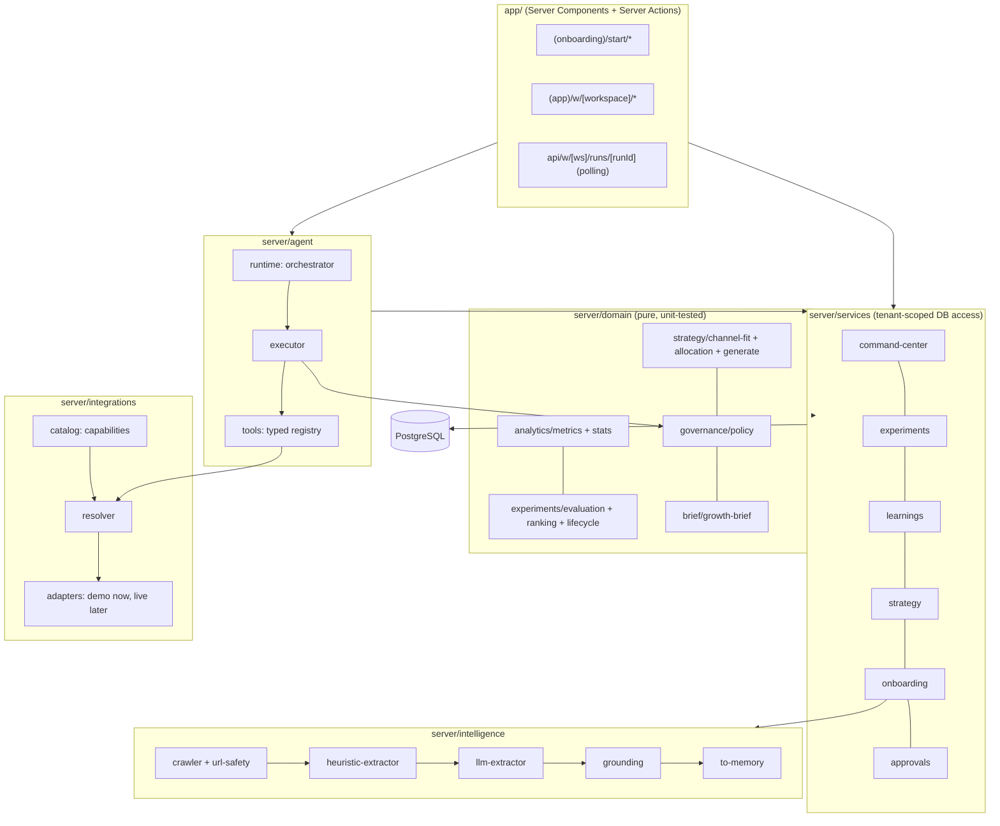

# Architecture

Modular monolith on Next.js 16 (App Router, Turbopack), TypeScript strict, PostgreSQL via Drizzle. One deployable, with hard internal boundaries between domain logic (pure), services (database), agent runtime, integrations and UI.

## Engines → code

| Engine (spec §5) | Code | Notes |
|---|---|---|
| Product Intelligence | `server/intelligence/*` | crawl → heuristic extraction → Claude refinement (optional) → grounding → proposed facts |
| Strategy | `server/domain/strategy/*`, `server/services/strategy.ts` | channel fit, allocation, strategy generation, versions |
| Experiment | `server/domain/experiments/*`, `server/services/experiments.ts` | lifecycle, ranking, statistical evaluation |
| Creative | `creative_assets` table, assets tied to experiments | generation not built |
| Execution | `server/agent/tools.ts`, `executor.ts`, `server/integrations/*` | typed tools call capabilities; adapters satisfy them |
| Analytics | `server/domain/analytics/*`, `server/services/metrics.ts` | deterministic; formulas travel with values |
| Learning | `server/services/learnings.ts` | results → learnings → ranking, suppression, channel-fit evidence |
| Governance | `server/domain/governance/policy.ts`, `services/approvals.ts`, `services/audit.ts` | policy in code, approvals, append-only audit |

## Tenancy

`Organization → Workspace → Product`. Every business table carries `workspace_id` (and `product_id` where product-specific). `requireWorkspace(slug)` resolves the workspace **through the member's organization**; services receive the resulting context and filter every query by `workspaceId`. The polling API goes through the same check. Integration test: `getExperimentDetail("ws_someone_else", 5)` returns nothing.

Authentication is a deliberate placeholder (see decision log): a session cookie selects a local user. Replacing it touches only `currentUser()`.

## Agent runtime

Orchestrator → context retrieval → plan → typed tools → policy → approval → execution → observation → learning.

- **Run state is persisted step by step** (`agent_runs`, `agent_steps`, `agent_messages`, `tool_calls`). An interrupted run stays inspectable; an approval resumes the exact stored tool input.
- **Intents are explicit handlers** (`diagnose`, `scale`, `allocate`, `grow`), selected deterministically. Numbers in agent messages come from tool outputs.
- **Executor order** (`agent/executor.ts`): validate input (Zod) → idempotency lookup → governance (`evaluatePolicy`) → approval request or execution → persist → audit. Policy is re-evaluated when an approved action executes, so an approval cannot push past a hard cap that changed meanwhile.
- **Idempotency**: writes are keyed by tool + identity (`ads.update_daily_budget:<campaign>:<amount>`); a succeeded write is never repeated. Reads are keyed per run.
- **Background work**: onboarding analysis and strategy generation run via `after()` and write progress into the run; the UI polls `/api/w/[ws]/runs/[runId]`. This replaces a workflow engine for now (decision log D-004).

## Governance

- Autonomy modes: Observe, Suggest, Copilot, Autopilot. Risk classes R0 Read, R1 Draft, R2 Publish, R3 Spend, R4 Sensitive.
- **Hard checks** (block regardless of mode or approval): allowed channels, max daily spend, projected monthly budget (spent + committed + proposed), max experiment budget.
- **Soft checks** (require approval): autonomy mode, automatic increase limit, capabilities that always need a human.
- Reducing exposure (pause, budget decrease) is always allowed outside Observe.
- `audit_logs` is append-only via database triggers.

## Integrations

Capability-first (spec §20). `catalog.ts` mirrors the Notion Integration Matrix: each provider declares read/write capabilities, auth type, risk and human-readable permissions. `resolver.ts` finds a connected integration that can satisfy a capability, preferring live over demo. Demo adapters implement the same `MarketingIntegrationAdapter` contract against local state only; every tool call through them is stored with `is_demo = true` and labelled in the UI. No live adapter is registered because no credentials exist.

## Product Intelligence safety

- **SSRF**: scheme/credentials/port/internal-host checks, DNS resolution checked against private ranges on every redirect hop, 1.5 MB and time limits. Residual DNS-rebinding risk documented; production should use an egress proxy.
- **Politeness**: robots.txt `Disallow` for `*`, identifying user agent, max 8 pages, 3 concurrent.
- **Prompt injection**: page content is wrapped in `<untrusted_page>` delimiters the page cannot close, the system prompt treats it as data, suspicious instructions are detected in both passes and shown to the founder.
- **Hallucination control**: the model must quote evidence; `grounding.ts` checks every quote and price against the crawl, halves confidence and strips unverifiable evidence. Nothing extracted is ever `confirmed` without a human.

## What's intentionally not here yet

Redis, a durable workflow engine, a token vault, and real OAuth. The schema and interfaces anticipate them (`credential_references`, `agent_runs` state machine, adapter contract); adding them doesn't change the domain.
