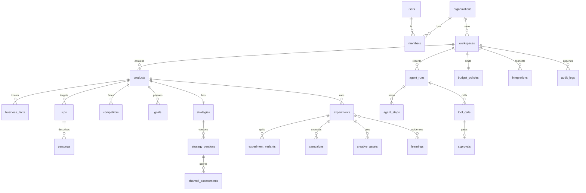

# Data model

Schema: `src/server/db/schema.ts`. Migrations: `drizzle/`. Mapping to Notion §17 noted where names differ.

## Ownership

Every row below `workspaces` carries `workspace_id`; product-specific rows also carry `product_id`.

## Entities

| Table | Notion entity | Purpose | Key fields |
|---|---|---|---|
| `organizations`, `users`, `members` | Organization, User | Tenancy and roles | `role`: owner/admin/member/viewer |
| `workspaces` | Workspace | Growth context; holds autonomy mode | `autonomy_mode`, `is_demo` |
| `products` | Product | The thing being grown | `status`, `onboarding_step` |
| `product_snapshots` | ProductSnapshot | Immutable record of each analysis | `pages` (fetch log), `extraction`, `extractor`, `prompt_version` |
| `knowledge_sources` | — (provenance) | Where a fact came from | `kind`: crawl_page/integration/user_input/experiment |
| `brand_profiles` | BrandProfile | Voice | traits, words to use/avoid |
| `business_facts` | MarketInsight + memory | **Business memory** | `kind` (verified/inferred/hypothesis/user_correction/learning), `status` (proposed/confirmed/rejected/superseded), `confidence`, `source_id`, `evidence`, `agent_generated`, `user_confirmed`, `supersedes_id`, `last_verified_at` |
| `icps`, `personas` | ICP, Persona | Who buys | pains, triggers, objections, where they are, priority, confidence, status |
| `competitors` | Competitor | Alternatives and wedges | kind, positioning, pricing, wedge, confidence, status |
| `goals` | Goal | Outcome + budget | template, metric, baseline, target, deadline, monthly_budget |
| `strategies`, `strategy_versions` | Strategy | Living strategy | `current_version`; version `content` (typed), `revision_reason`, `evidence_learning_ids` |
| `channel_assessments` | ChannelRecommendation | Channel Fit per version | score, verdict, factors, rationale, evidence |
| `experiments` | Experiment | Atomic unit of growth | hypothesis, audience, channel, primary_metric, success_threshold, budget, spend, status, outcome, observed_value, lift, confidence, ranking inputs, `similarity_key`, `suppressed_reason` |
| `experiment_variants` | ExperimentVariant | Raw counts per arm | exposures, conversions, spend |
| `campaigns` | Campaign | External execution unit | external_id, daily_budget, spend, `is_demo` |
| `creative_assets` | Asset, ContentItem, LandingPage | Assets tied to experiments | kind, body, status |
| `metric_snapshots` | MetricSnapshot | Daily raw counts per channel (`all` = blended) | impressions → customers, MRR movement, spend, `source` |
| `analytics_events` | AnalyticsEvent, RevenueEvent | Normalized events (§18) | name, ids, source, channel, campaign, experiment, variant, value |
| `learnings` | Learning | Reusable evidence | statement, kind (winner/loser/insight), `similarity_key`, confidence, impact, `evidence_experiment_ids`, expires_at |
| `agent_runs`, `agent_steps`, `agent_messages` | AgentRun | Inspectable run state | goal, plan, planner, model, prompt_version, status, result |
| `tool_calls` | ToolCall, Action | Every tool invocation | capability, risk, input, output, status, dry_run, `idempotency_key` (unique per workspace), adapter, `is_demo` |
| `approvals` | Approval | Human gate | title, change, reason, risk, stored tool input, `policy_decision`, status, decided_by |
| `budget_policies` | BudgetPolicy | Hard limits | monthly, max daily, max per experiment, max auto increase, flags, allowed channels, never-without-approval |
| `audit_logs` | AuditLog | Append-only trail | actor, action, target, tool_call, approval, `is_external_mutation`, payload |
| `integrations`, `credential_references` | Integration, CredentialReference | Connections | status, `mode` (live/demo), granted capabilities, health, last sync, sync error; credentials by vault reference only |

## Key design choices

- **Raw counts, derived metrics.** `metric_snapshots` and `experiment_variants` store counts; rates, CAC, ROAS, lift and confidence are always computed in `domain/analytics` and `domain/experiments`.
- **Corrections supersede.** A founder correction inserts a `user_correction` fact pointing at the agent's original (`supersedes_id`) and marks the original `superseded`. History is never lost.
- **Similarity keys give memory teeth.** `channel:tactic:target` on experiments and learnings lets the ranker suppress a disproved tactic on any target and boost a proven tactic elsewhere.
- **Not yet modeled from §17**: AdGroup, Ad, Audience, AttributionTouch, Recommendation (derived at read time), Notification.
